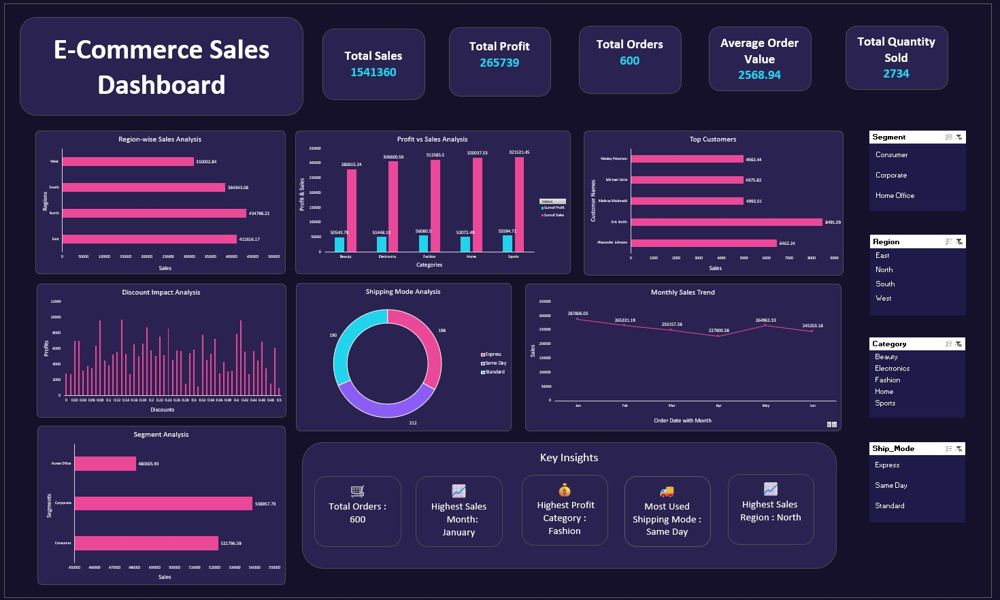

# Ecommerce-Sales-Dashboard

## 📊 Project Overview

The E-Commerce Sales Dashboard is an interactive data analysis and visualization project created using Microsoft Excel and Power Query.

It provides insights into sales, profit, orders, customers, categories, regions, shipping modes, discounts, and monthly sales trends.

## 🎯 Objective

To analyze e-commerce sales data and identify meaningful business trends and insights using an interactive dashboard.

## 🛠️ Tools & Technologies

- Microsoft Excel
- Power Query
- Pivot Tables
- Pivot Charts
- Slicers
- KPI Cards
- Data Cleaning
- Data Visualization

## 📌 Dashboard Features

- Total Sales
- Total Profit
- Total Orders
- Average Order Value
- Total Quantity Sold
- Region-wise Sales Analysis
- Profit vs Sales Analysis
- Top Customers Analysis
- Discount Impact Analysis
- Shipping Mode Analysis
- Monthly Sales Trend
- Segment Analysis
- Interactive Filters

## 📈 Key Insights

- Total Sales: 1,541,360
- Total Profit: 265,739
- Total Orders: 600
- Average Order Value: 2,568.94
- Total Quantity Sold: 2,734
- Highest Sales Region: North
- Highest Profit Category: Fashion
- Highest Sales Month: January
- Most Used Shipping Mode: Same Day

## 💡 Skills Demonstrated

- Data Cleaning
- Data Transformation
- Data Analysis
- Data Visualization
- Dashboard Development
- Business Insights
- Microsoft Excel
- Power Query

  ## 📷 Dashboard Preview

